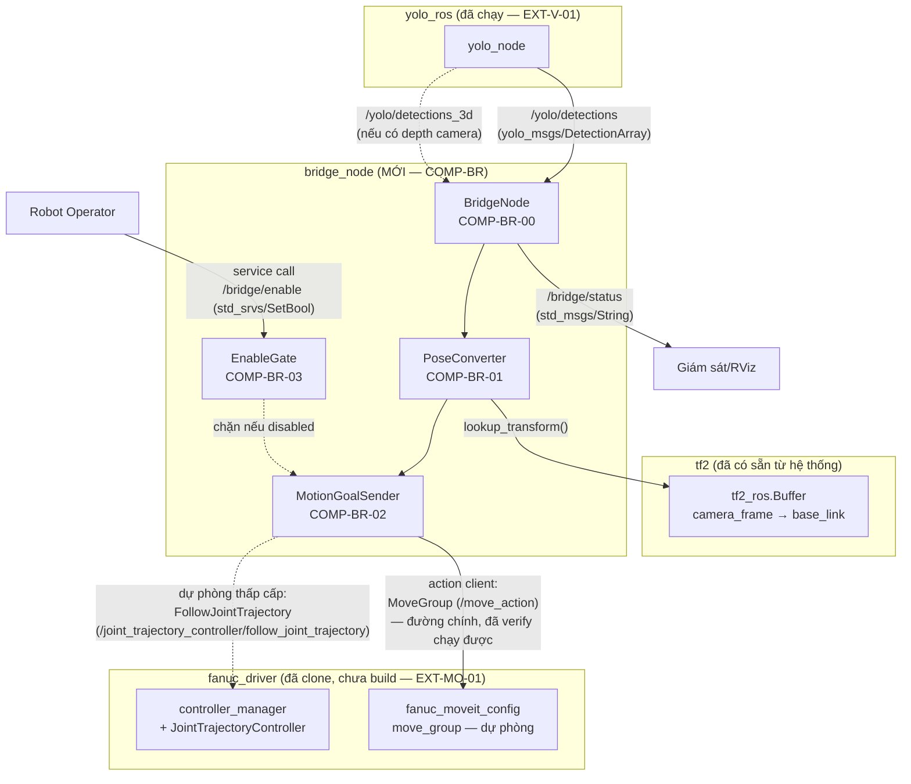
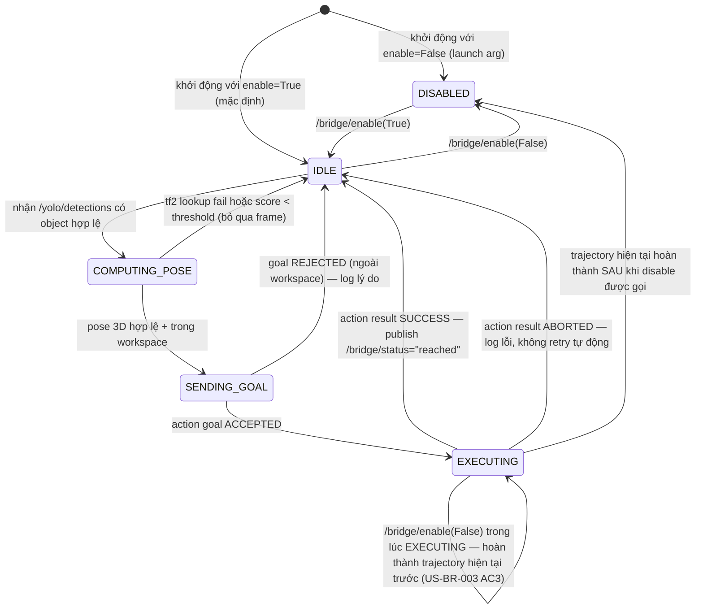
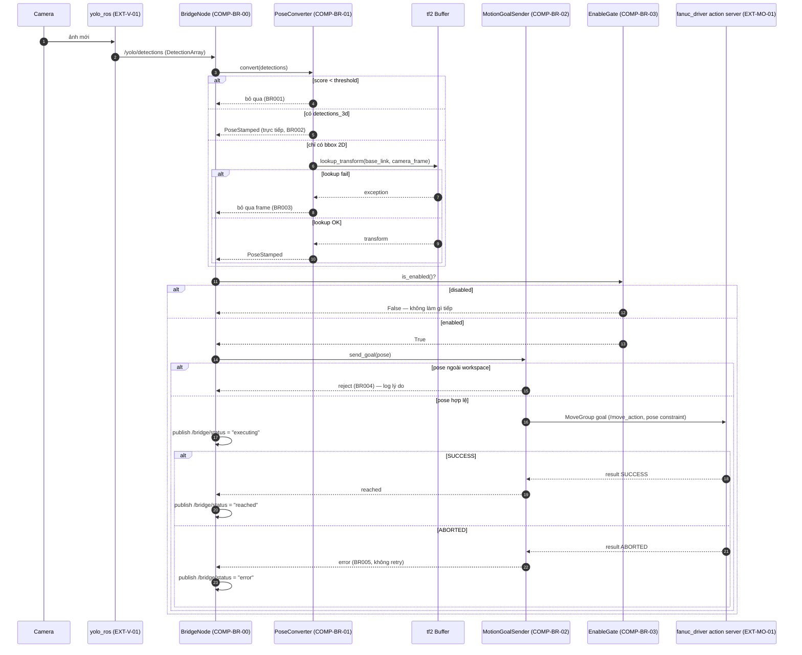
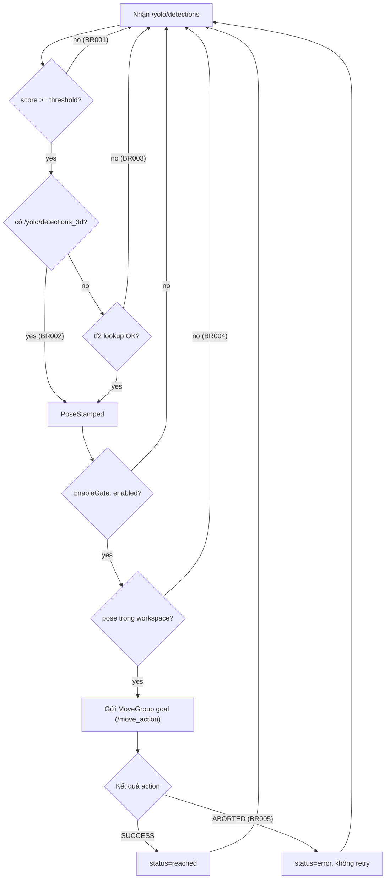

# DDB-BR-001. Detailed Design — Bridge Node (Vision → Motion) (詳細設計)

> **Tham chiếu nhanh:** [user-stories.md](../requirements/user-stories.md), [ROADMAP.md](../../ROADMAP.md), [review_story](../reviews/review_story_user-stories_20260911.md)
>
> **Mục đích:** Mô tả chi tiết logic bên trong của Bridge Node — node ROS2 mới duy nhất cần code trong pipeline, nối `yolo_ros` (vision, đã chạy) với `fanuc_driver` (motion, đã clone, chưa build/test). Đủ chi tiết để implement không cần đoán thêm.
>
> **Lưu ý về việc áp dụng IEEE 1016 cho ROS2 node**: Template gốc (DDB-api) được viết cho REST API (HTTP/DB). Dự án này không có HTTP/DB — bảng ánh xạ thuật ngữ dưới đây thay thế cho tương đương ROS2:
>
> | Khái niệm REST gốc | Tương đương trong Bridge Node (ROS2) |
> |---|---|
> | Endpoint (METHOD /path) | Topic/Service/Action (tên + message type) |
> | Auth (JWT) | Không áp dụng (ROS2 graph nội bộ, cùng máy/LAN) — an toàn vật lý thay cho auth, xem §9 |
> | Database query/write | tf2 lookup + ROS2 parameter + action goal gửi đi |
> | HTTP error code | Kết quả reject/abort của goal + log level |
> | REG-code | Chưa có — dùng bảng §1.1 dưới đây |
>
> **Gate:** [GCK-g5] — tài liệu này cần Tech Lead approve trước khi bắt đầu code thật.

---

## 1. Thông tin tài liệu

| Trường | Giá trị |
|---|---|
| Dự án | ros2-physical-ai |
| Component Code | COMP-BR (Bridge Node) |
| Package ROS2 | `bridge_node` (mới, chưa tồn tại — đề xuất tên) |
| Ngôn ngữ | Python (rclpy) — khớp `yolo_ros` (Python) và pattern phổ biến của `ros2_control` action client |
| Auth | Không áp dụng (nội bộ ROS2 graph) |
| User Story ref | [US-BR-001, US-BR-002, US-BR-003](../requirements/user-stories.md) |
| Tech Lead | — |
| Reviewer | — |

### 1.1 Bảng Component & Code (thay REG-code — chưa có registry chính thức)

| Code | Tên | Loại | Vai trò |
|---|---|---|---|
| COMP-BR-01 | `PoseConverter` | Internal class | Chuyển bbox 2D/3D detection → PoseStamped trong `base_link` (US-BR-001) |
| COMP-BR-02 | `MotionGoalSender` | Internal class | Kiểm tra workspace + gửi action goal tới `fanuc_driver` (US-BR-002) |
| COMP-BR-03 | `EnableGate` | Internal class | Giữ trạng thái enable/disable, chặn `MotionGoalSender` khi disabled (US-BR-003) |
| COMP-BR-00 | `BridgeNode` | rclpy Node | Node chính, khởi tạo 3 component trên + subscriber/tf2/action client |
| EXT-V-01 | `yolo_ros` (`yolo_node`) | External (reuse) | Publish `/yolo/detections`, `/yolo/detections_3d` — xem [US-V-001] |
| EXT-MO-01 | `fanuc_driver` action server | External (reuse) | Nhận `FollowJointTrajectory` goal, điều khiển tay máy — xem [US-MO-001] |

---

## 2. Composition View

> *IEEE 1016 — Composition Viewpoint: các component tham gia và quan hệ giữa chúng — bao gồm cả module đã có sẵn (EXT-*) mà Bridge Node gọi tới.*



**Ghi chú quan trọng (đúng theo yêu cầu — không bịa module)**:
- `yolo_ros` và `fanuc_driver` là 2 package **đã tồn tại**, Bridge Node chỉ gọi vào interface public của chúng (topic/action), **không sửa code** của 2 package này.
- Tên action và node/controller trong diagram này là **tên thật đã verify** bằng cách build + launch `fanuc_moveit_config` (`use_mock:=true`, `robot_model:=crx10ia`) và chạy `ros2 action list` — không phải suy đoán (xem §10, Open Issue #1/#2 đã đóng).

---

## 3. State Dynamics View

> *IEEE 1016 — State Dynamics Viewpoint: trạng thái vận hành của Bridge Node.*



---

## 4. Logical View (Business Rules)

> *Trích trực tiếp từ AC của US-BR-001/002/003 — đánh số BR theo thứ tự xuất hiện.*

### BR001 — Bỏ qua detection dưới ngưỡng confidence

**Áp dụng tại:** COMP-BR-01
**Story:** US-BR-001 AC3

```
Given detection message mới từ /yolo/detections
When  object có score < threshold cấu hình được
Then  bỏ qua object đó, không tính pose, không log lỗi (hành vi bình thường)
```

### BR002 — Ưu tiên detections_3d nếu có

**Áp dụng tại:** COMP-BR-01
**Story:** US-BR-001 AC2

```
Given /yolo/detections_3d có publish (depth camera gắn sẵn)
When  nhận được pose 3D trực tiếp từ topic này
Then  dùng trực tiếp, không tự tính lại từ bbox 2D qua tf2
```

### BR003 — tf2 lookup fail → bỏ qua frame, không crash

**Áp dụng tại:** COMP-BR-01
**Story:** US-BR-001 AC4

```
Given cần tính pose 3D từ bbox 2D (không có depth)
When  tf2 lookup_transform(camera_frame, base_link) throw exception (transform chưa sẵn sàng)
Then  log warning throttle (tối đa 1 lần/5s), bỏ qua frame hiện tại, node tiếp tục chạy
```

### BR004 — Từ chối goal ngoài workspace

**Áp dụng tại:** COMP-BR-02
**Story:** US-BR-002 AC2

```
Given có pose 3D hợp lệ từ COMP-BR-01
When  pose nằm ngoài giới hạn workspace/reach đã cấu hình (bounding box hoặc reach radius)
Then  không gửi goal tới action server, log rõ lý do (pose + giới hạn vi phạm)
```

### BR005 — Không tự động retry khi goal abort

**Áp dụng tại:** COMP-BR-02
**Story:** US-BR-002 AC4

```
Given action goal đã gửi tới fanuc_driver
When  action server trả ABORTED hoặc lỗi
Then  log lỗi, giữ trạng thái IDLE — KHÔNG tự động gửi lại goal cũ (chờ detection mới)
```

### BR008 — Chặn detection mới khi đang EXECUTING (single-flight)

**Áp dụng tại:** COMP-BR-02
**Nguồn:** Gap phát hiện khi chuẩn bị chạy vision+motion song song thật (2026-09-11) — State Dynamics View (§3) đã vẽ EXECUTING không nhận SENDING_GOAL mới, nhưng code ban đầu KHÔNG enforce điều này. Với test 1-detection-mỗi-lần trước đó không lộ ra; khi `yolo_ros` chạy liên tục 3Hz trong lúc tay máy di chuyển (~5-10s), sẽ gửi chồng nhiều goal cùng lúc tới `move_group` nếu không chặn.

```
Given tay máy đang EXECUTING 1 goal đã gửi trước đó (is_busy() == True)
When  có detection mới tới (bất kể enable/disable)
Then  bỏ qua detection đó hoàn toàn (không tính lại, không gửi), giữ nguyên goal đang chạy
```

**Verify thật (2026-09-11):** chạy `yolo_ros` + camera stream 3Hz liên tục song song `bridge_node` + `fanuc_moveit_config` mock hardware — trong lúc 1 goal executing (~5-10s), hàng chục detection mới (rate 3Hz) đều bị chặn đúng bởi guard này, `/yolo/detections` không hề bị gián đoạn (vẫn giữ 3Hz suốt) — xác nhận vision không chặn motion và motion không bị chồng lấp.

**[CẬP NHẬT 2026-09-11, code review pre-delivery — BLOCKER B1]** Fix ban đầu dùng 1 biến `bool` thường (`self._busy`) — **KHÔNG thread-safe**. `bridge_node.py` đặt subscriber detection và action client vào cùng 1 `ReentrantCallbackGroup` dưới `MultiThreadedExecutor`, nghĩa là 2 detection callback có thể chạy đồng thời trên 2 thread khác nhau. Giữa lúc kiểm tra `is_busy()` và lúc set `_busy = True`, có gọi `is_in_workspace()` + `server_is_ready()` (có thể nhả GIL) — đủ thời gian cho 2 thread cùng đọc `_busy == False` trước khi cả hai cùng set `True` và gửi goal, tức là **đúng chính lỗi mà BR008 định sửa vẫn xảy ra được**. Fix thật: bọc toàn bộ "check busy → check workspace → check server → set busy → gửi" trong 1 `threading.RLock()` (không dùng `Lock` thường vì test double gọi callback đồng bộ, dễ tự deadlock khi cùng thread cố lock lại lần 2). Có test race thật bằng 8 thread chạy đồng thời xác nhận đúng 1 goal được gửi.

### BR009 — Bỏ qua frame khi CameraInfo chưa calibrate (fx/fy = 0)

**Áp dụng tại:** COMP-BR-01
**Nguồn:** MAJOR M1, code review pre-delivery 2026-09-11 — `CameraInfo.k` mặc định toàn số 0 (thường gặp ngay lúc camera driver mới khởi động, chưa publish intrinsics thật) vượt qua được check `is None`, nhưng gây `ZeroDivisionError` trong `pixel_to_camera_ray` — không có try/except bao quanh như nhánh tf2, khiến callback lỗi liên tục thay vì xuống cấp nhẹ nhàng.

```
Given cần tính pose 3D từ bbox 2D (không có depth)
When  camera_info.k[0]==0 hoặc camera_info.k[4]==0 (fx/fy chưa calibrate)
Then  log warning throttle, bỏ qua frame — xử lý giống nhánh tf2 fail (BR003), không crash
```

### BR007 — Kiểm tra action server sẵn sàng trước khi gửi goal

**Áp dụng tại:** COMP-BR-02
**Nguồn:** Bug phát hiện qua integration test (TC-008) 2026-09-11, không có trong thiết kế gốc — `send_goal_async()` gọi khi action server không khả dụng thì KHÔNG BAO GIỜ resolve (không exception, không callback), khiến node treo vô hạn ở trạng thái EXECUTING.

```
Given cần gửi goal MoveGroup
When  action_client.server_is_ready() trả False (server chưa lên hoặc đã chết)
Then  KHÔNG gọi send_goal_async(), publish /bridge/status=error ngay, log lỗi rõ ràng
```

**Giới hạn đã biết:** không bắt được race hiếm (server chết đúng lúc giữa check và send) — chấp nhận được cho MVP.

### BR006 — Disable không cắt ngang trajectory đang chạy

**Áp dụng tại:** COMP-BR-03
**Story:** US-BR-003 AC3

```
Given tay máy đang EXECUTING 1 trajectory đã gửi trước đó
When  operator gọi /bridge/enable(False)
Then  tay máy hoàn thành trajectory hiện tại (không cancel goal đang chạy), sau đó COMP-BR-03 mới chặn goal mới
```

---

## 5. Information View

> *Bridge Node không có database — "data access" ở đây là tf2 lookup, ROS2 parameter, và action goal gửi đi (side-effect duy nhất tác động ra ngoài hệ thống).*

### 5.1 Đọc (Reads)

| Read ID | Component | Nguồn | Mục đích |
|---|---|---|---|
| RD001 | COMP-BR-00 | Topic `/yolo/detections` (yolo_msgs/DetectionArray) | Input chính — danh sách object phát hiện |
| RD002 | COMP-BR-00 | Topic `/yolo/detections_3d` (yolo_msgs/DetectionArray, nếu có) | Input ưu tiên khi có depth (BR002) |
| RD003 | COMP-BR-01 | tf2 Buffer: `lookup_transform(base_link, camera_frame)` | Chuyển bbox → pose trong robot base frame |
| RD004 | COMP-BR-02 | ROS2 parameter: `workspace_bounds` (min/max xyz hoặc reach_radius) | Kiểm tra BR004 |
| RD005 | COMP-BR-00 | ROS2 parameter: `score_threshold`, `enable_on_start` | Cấu hình runtime |

### 5.2 Viết (Writes / Side effects)

| Write ID | Component | Đích | Điều kiện trigger |
|---|---|---|---|
| WRT001 | COMP-BR-02 | Action goal `FollowJointTrajectory` tới `fanuc_driver` | Khi pose hợp lệ qua BR004 |
| WRT002 | COMP-BR-00 | Topic `/bridge/status` (std_msgs/String: "idle"\|"executing"\|"reached"\|"error") | Mỗi lần state đổi (xem §3) |
| WRT003 | COMP-BR-03 | Internal state `enabled: bool` (không persist, reset về default khi restart node) | Khi `/bridge/enable` được gọi |

Không có transaction (không có multi-write cần atomic) — mỗi write độc lập.

---

## 6. Interface View

> *Contract của Bridge Node — những gì node khác/operator nhìn thấy từ bên ngoài.*

### 6.1 Subscribed topics (input)

| Topic | Type | QoS | Nguồn |
|---|---|---|---|
| `/yolo/detections` | `yolo_msgs/DetectionArray` | Best Effort (khớp `image_reliability` mặc định của yolo_ros) | `yolo_ros` (EXT-V-01) |
| `/yolo/detections_3d` | `yolo_msgs/DetectionArray` | Best Effort | `yolo_ros` (EXT-V-01, optional) |

### 6.2 Published topics (output)

| Topic | Type | Mục đích |
|---|---|---|
| `/bridge/status` | `std_msgs/String` | Trạng thái pipeline hiện tại — xem §3 State Dynamics |

### 6.3 Service

| Service | Type | Request | Response |
|---|---|---|---|
| `/bridge/enable` | `std_srvs/SetBool` | `data: bool` | `success: bool`, `message: string` |

**Business rule liên quan:** BR006

### 6.4 Action client (Bridge Node là client, không phải server)

**Tên đã verify thật (2026-09-11, `fanuc_moveit_config`, `use_mock:=true`, `robot_model:=crx10ia`, `ros2 action list`):**

| Action | Type | Server | Goal fields dùng |
|---|---|---|---|
| `/move_action` **(đường chính)** | `moveit_msgs/action/MoveGroup` | `move_group` (`fanuc_moveit_config`, EXT-MO-01) | `request.goal_constraints` (Cartesian pose constraint dựng từ `PoseStamped` của COMP-BR-01) — MoveIt2 tự IK + collision-aware planning, không cần Bridge Node tự tính |
| `/joint_trajectory_controller/follow_joint_trajectory` **(dự phòng thấp cấp)** | `control_msgs/action/FollowJointTrajectory` | `joint_trajectory_controller` (type `fanuc_controllers/ScaledJointTrajectoryController`) | `trajectory` (JointTrajectory) — chỉ dùng nếu cần bỏ qua planning (waypoint đã biết trước) |

Xác nhận thêm: `/joint_states` publish `frame_id: base_link`, tên khớp `J1..J6` — khớp giả định `base_link` trong tf2 lookup ở §5.

**Kết quả (thay cho "Error table" của REST)**:

| Outcome | Khi nào | Business rule |
|---|---|---|
| Goal không gửi (REJECTED trước khi gửi) | Pose ngoài workspace | BR004 |
| Goal ACCEPTED → SUCCESS | Trajectory thực thi xong | (happy path) |
| Goal ACCEPTED → ABORTED | fanuc_driver phát hiện lỗi/va chạm giữa đường | BR005 |

---

## 7. Interaction View

> *Sequence + flowchart cho toàn bộ chu trình 1 detection → 1 lần di chuyển — đây là phần user yêu cầu vẽ rõ Bridge Node gọi module nào.*





**Side effects:**
- [x] Publish `/bridge/status` mỗi lần state đổi
- [ ] Audit log — không áp dụng (không có yêu cầu compliance ở giai đoạn này)
- [ ] Notification — không áp dụng

---

## 8. Resource View

> *Rủi ro hiệu năng thực sự — liên quan trực tiếp mục tiêu ROADMAP Phase 4 (giảm 2-3s/chu kỳ).*

| Điểm rủi ro | Component | Giải pháp | Threshold cảnh báo |
|---|---|---|---|
| tf2 lookup latency (transform chưa sẵn sàng do buffer chưa đủ dữ liệu) | COMP-BR-01 | Dùng `lookup_transform` với timeout ngắn (vd 0.1s) + throttle log, không block toàn node | > 100ms lookup |
| Chờ action result đồng bộ (nếu code sai kiểu blocking) | COMP-BR-02 | PHẢI dùng action client bất đồng bộ (callback), không block executor — khớp Phase 1 (MultiThreadedExecutor + callback group) đã học | Node không phản hồi > 1 chu kỳ detection |
| Nhiều detection tới trong lúc đang EXECUTING | COMP-BR-00 | Theo state machine §3 — bỏ qua detection mới khi đang EXECUTING (không queue), lấy detection mới nhất sau khi rảnh — khớp ROADMAP Phase 4 "shared latest detection state" | N/A cho MVP, tối ưu ở bản sau |

---

## 9. Safety Overlay *(thay cho Security Overlay — không áp dụng auth/network security ở giai đoạn LAN nội bộ)*

| Yêu cầu | Mô tả | Ghi chú |
|---|---|---|
| Workspace bounds check | BR004 — bắt buộc trước MỌI goal gửi đi | Không tin tưởng mù quáng vào MoveIt2 collision check phía `fanuc_driver`, kiểm tra sớm ở tầng Bridge |
| Không tự động retry | BR005 — tránh lặp lại hành động nguy hiểm khi có lỗi chưa rõ nguyên nhân | Yêu cầu operator/hệ thống giám sát can thiệp thủ công |
| Disable không cắt ngang chuyển động | BR006 | Tránh dừng đột ngột giữa trajectory gây giật cơ khí |
| Không có network/auth security | ROS2 graph nội bộ, giả định DDS chạy trên LAN riêng cách ly | Nếu sau này mở ra ngoài LAN, cần đánh giá lại SROS2 (DDS security) — hiện tại ngoài phạm vi |

---

## 10. Design Rationale

| Quyết định | Lý do | Phương án đã xem xét |
|---|---|---|
| **[CẬP NHẬT 2026-09-11 sau khi build+run thật]** Dùng `MoveGroup` action (`/move_action`) làm đường chính, không tự viết IK | Đã build+chạy `fanuc_moveit_config` với `use_mock:=true` (crx10ia) trên máy — xác nhận `move_group` hoạt động sẵn với OMPL pipeline + kinematics solver (từ `ros-jazzy-moveit-kinematics`). Gửi `PoseStamped` qua MoveGroup để MoveIt2 tự lo IK + collision-aware planning — giải quyết gọn Open Issue #2 cũ, không cần code IK riêng | Quyết định MVP ban đầu (dùng `FollowJointTrajectory` trực tiếp, tự tính IK) — đổi lại vì đã verify MoveGroup chạy được thật, tự viết IK phức tạp hơn không cần thiết. `FollowJointTrajectory` (`/joint_trajectory_controller/follow_joint_trajectory`, action server thật đã xác nhận) giữ làm phương án dự phòng thấp cấp nếu cần bỏ qua planning (ví dụ waypoint đã biết trước, không cần tránh vật cản) |
| Không queue detection khi đang EXECUTING | Đơn giản hóa state machine cho MVP, tránh phức tạp hóa concurrency sớm | Queue + xử lý detection mới nhất ngay khi rảnh — đúng hướng ROADMAP Phase 4 "pipeline/lookahead" nhưng để lại cho bản tối ưu sau, không phải MVP |
| Bỏ qua object di động (không track/predict) | Ngoài phạm vi US-SY-001 (đã ghi rõ trong user story) | Kalman filter/extrapolate — ROADMAP Phase 4 bước 4, để sau |

---

## 11. Test Case Reference

> *Test case viết ở tài liệu riêng (khi chạy `/tdd` hoặc test-sheet). Mỗi BR ở §4 tương ứng 1 test case tối thiểu.*

| BR ID | Loại test |
|---|---|
| BR001-BR003 | Unit test cho `PoseConverter` (mock tf2 buffer) |
| BR004-BR005 | Unit test cho `MotionGoalSender` (mock action client) |
| BR006 | Integration test trên Gazebo (cần `fanuc_driver` build xong — US-MO-001) |

---

## 12. Open Issues

| # | Vấn đề | Ảnh hưởng | Owner | Trạng thái |
|---|---|---|---|---|
| 1 | Tên action server chính xác của `fanuc_driver` | COMP-BR-02 | — | ✅ **Đóng 2026-09-11** — build+run `fanuc_moveit_config` (`use_mock:=true`, `robot_model:=crx10ia`) xác nhận `/move_action` + `/joint_trajectory_controller/follow_joint_trajectory` (xem §6.4) |
| 2 | Chưa xác định cách tính `JointTrajectory` từ `PoseStamped` (IK) | COMP-BR-02 | — | ✅ **Đóng 2026-09-11** — dùng `MoveGroup` action, để MoveIt2 (`move_group`, đã verify chạy với OMPL pipeline) tự lo IK, không tự viết (xem §10) |
| 3 | Giá trị cụ thể `workspace_bounds` (kích thước thật của Fanuc robot) chưa có — đang dùng box tạm `[-1,1]×[-1,1]×[0,1.5]` (m), verify được bằng test thật là "roughly đúng cấp độ" cho crx10ia (test TC-007 dùng điểm ngoài box này và cũng ngoài tầm với thật) nhưng chưa phải số đo chính xác | COMP-BR-02 | — | Open — cần đo/lấy từ thông số robot thật hoặc giới hạn reach chính xác của `crx10ia` khi có |
| 7 | **[MỚI, code review pre-delivery 2026-09-11 — MAJOR M2]** `_find_matching_3d` ghép 2D↔3D chỉ bằng `class_id` (yolo_msgs không có shared instance id). Nếu xưởng có ≥2 vật cùng loại trong tầm nhìn, có thể ghép sai pose 3D cho instance khác. Đã fix an toàn hơn: nếu >1 detection_3d cùng class_id → coi là ambiguous, fallback sang nhánh 2D+tf2 (tự nhất quán, không đoán) thay vì lấy liều 1 trong 2 | COMP-BR-01 | — | Đã giảm rủi ro (không ghép sai nữa) nhưng vẫn Open ở mức "single-object-per-class là precondition ngầm cho 1 lần thử hợp lệ" — cần nêu rõ với kỹ sư xưởng (xem kịch bản test Mục 2.2) |
| 4 | `fanuc_gpio_controller` và `force_torque_sensor_broadcaster` không activate được khi launch mock (thiếu state interface `ConnectionStatus/motion_command_type`, và loader không tìm thấy plugin type) | Không ảnh hưởng Bridge Node (chỉ dùng `joint_trajectory_controller` + `move_group`) | — | Open — không chặn US-BR-*, ghi nhận để không nhầm là lỗi setup của mình khi thấy log lỗi này |
| 5 | **[MỚI, phát sinh khi implement]** `table_height` (mặt phẳng Z giả định vật thể nằm trên, dùng để back-project bbox 2D → điểm 3D) đang hard-code default `0.0` (parameter, đổi được) — chưa có số đo bàn/mặt phẳng thật | COMP-BR-01 | — | Open — cần đo chiều cao mặt phẳng thật khi có setup camera+bàn thật, hoặc dùng depth camera (`/yolo/detections_3d`, đã có nhánh BR002) để bỏ qua giả định này hoàn toàn |
| 6 | **[MỚI, phát sinh khi implement]** `grasp_orientation_rpy` (hướng tiếp cận gắp vật) đang hard-code default `[0,0,0]` (identity) — bbox 2D không mang thông tin hướng, đây là giá trị đặt cứng chưa verify với convention thật của link `flange` trên hardware/RViz | COMP-BR-01 | — | Open — cần verify hướng "gripper hướng xuống" thật trong RViz với `crx10ia` trước khi dùng cho gắp vật thật (hiện tại chỉ ảnh hưởng orientation constraint khi planning, chưa có gripper) |
| 8 | **[MỚI, phát hiện khi viết kịch bản test thật 2026-09-12]** Toàn bộ hệ thống giả định transform camera→base_link **cố định tuyệt đối** sau khi đo/cấu hình. Không có cơ chế nào tự phát hiện nếu camera bị xê dịch (va chạm, tháo lắp lại, rung động mạnh) — nếu xảy ra, mọi pose tính ra sẽ sai một cách âm thầm (không lỗi, không cảnh báo), có thể khiến robot di chuyển tới vị trí không đúng | COMP-BR-01 | — | Open — MVP không có giám sát rung/lệch camera. Đã đưa cảnh báo thủ công vào kịch bản test (`TEST-SCENARIO-real-robot-trial.md` Mục 2.1: "nếu nghi ngờ camera bị xê dịch, đo lại từ đầu"). Giám sát tự động (ví dụ so khớp ảnh/marker cố định để phát hiện lệch) là cải tiến cho bản sau, chưa làm |

---

## Lịch sử thay đổi

| Ngày | Phiên bản | Thay đổi | Người thực hiện |
|---|---|---|---|
| 2026-09-11 | 0.1 | Khởi tạo — Composition/State/Logical/Information/Interface/Interaction/Resource/Safety views cho Bridge Node | Hoang Duc |
| 2026-09-11 | 0.2 | Verify thật trên `fanuc_moveit_config` mock hardware — đóng Open Issue #1/#2, đổi sang MoveGroup action; implement package `bridge_node` (14 unit test pass) + integration test trên simulator (TC-005/006/007/008/009/010/011 pass); phát hiện + fix bug thật (BR007, action server chết → node hang vô hạn); thêm Open Issue #5/#6 (table_height, grasp_orientation — phát sinh khi implement PoseConverter) | Hoang Duc |
| 2026-09-12 | 0.3 | Code review pre-delivery: tìm 1 BLOCKER (B1 — busy-guard BR008 không thread-safe, fix bằng `threading.RLock`) + 2 MAJOR (M1 — chia 0 khi CameraInfo chưa calibrate, thêm BR009; M2 — ghép sai 2D↔3D khi nhiều vật cùng class, thêm Open Issue #7) trước khi đóng gói gửi xưởng. Cả 3 đã fix + có test, 18/18 unit test pass | Hoang Duc |

---

*Tài liệu này là input cho Gate GCK-g5. Open Issue #1 và #2 nên được giải quyết (build `fanuc_driver` trên Gazebo, chốt IK strategy) trước khi implement §6.4 và §7.*
